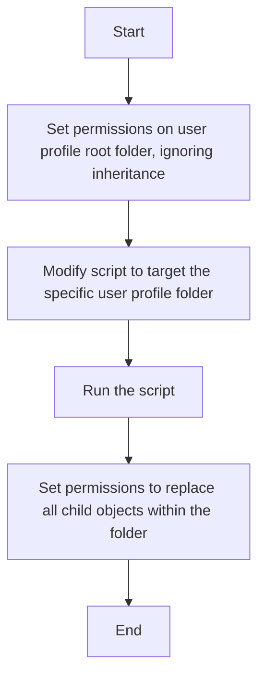

# Take Ownership PowerShell Script

## Purpose
This PowerShell script is designed to help users take ownership of files and directories within a specific user profile directory, providing solution for access denied errors when enabling inheritance for a user account.

## Use Case
Global Desktop Management (GDM) often opens tickets for accounts where migrations fail due to permission issues. When a Wintel administrator investigates, they discover that custom folder permissions are preventing proper inheritance of default permissions. This causes "Access Denied" errors when attempting to explicitly set permissions on the root folder.

This script resolves the issue by taking ownership of all files and folders within a user's profile directory and assigning ownership to the logged-in user. This enables proper application of top-level permissions and inheritance. The permissions will propagate to all files and folders without issues.

## Steps to Use the Script



## Use Case
Global Desktop Management (GDM) often opens tickets for accounts where migrations fail due to permission issues. When a Wintel administrator investigates, they discover that custom folder permissions are preventing proper inheritance of default permissions. This causes "Access Denied" errors when attempting to explicitly set permissions on the root folder.

This script resolves the issue by taking ownership of all files and folders within a user's profile directory and assigning ownership to the logged-in user. This enables proper application of top-level permissions and inheritance. The permissions will propagate to all files and folders without issues.

## Steps to Use the Script

Set the correct permissions on the user profile root folder, ignoring inheritance.
Modify the script to target the specific user profile folder.
Run the script.
Return to the user profile folder and set the permissions to replace all child objects within the folder.

graph TD
    A[Start] --> B[Set permissions on user profile root folder, ignoring inheritance]
    B --> C[Modify script to target the specific user profile folder]
    C --> D[Run the script]
    D --> E[Set permissions to replace all child objects within the folder]
    E --> F[End]

## Script Parameters
- `-Confirm` (default: true): Prompts user for confirmation before making changes
- `-DryRun`: Allows running the script in preview mode without making actual changes

## Workflow

### 1. Initialization
- Creates a timestamped log file in `C:\temp\`
- Defines the current user and target profile path
- Validates that the target path is within the allowed directory (`E:\SHARES\UserDir\`)

### 2. Pre-Ownership Analysis
- Logs current script details (user, target folder)
- Generates an initial file listing of the target directory
- Captures all files and subdirectories within the specified path
- Handles potential access restrictions gracefully

### 3. Ownership Transfer Process
- Provides a confirmation prompt (if not disabled)
- Uses Windows built-in tools:
  - `takeown.exe`: Takes ownership of files/directories
  - `icacls.exe`: Grants full control permissions to the current user

### 4. Post-Ownership Verification
- Generates an updated file listing after ownership transfer
- Creates a comprehensive log of all actions
- Saves log file for audit purposes

## Safety Mechanisms
- Restricted to specific directory (`E:\SHARES\UserDir\`)
- Skips system and recycle bin directories
- Provides optional confirmation step
- Generates detailed logging
- Supports dry-run mode for previewing changes

## Log File Details
- Location: `C:\temp\ownership_changes_[TIMESTAMP].txt`
- Contains:
  - Script execution details
  - Initial file listing
  - Ownership transfer actions
  - Final file listing
  - Timestamp of operation

## Usage Examples
```powershell
# Standard usage with confirmation
.\take-ownership.ps1

# Skip confirmation
.\take-ownership.ps1 -Confirm:$false

# Preview changes without modifying
.\take-ownership.ps1 -DryRun
```

## Caution
- Only use on directories you have legitimate access to modify
- Understand the implications of changing file ownership
- Review log files to confirm expected changes
